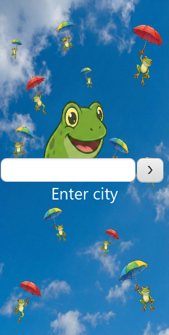
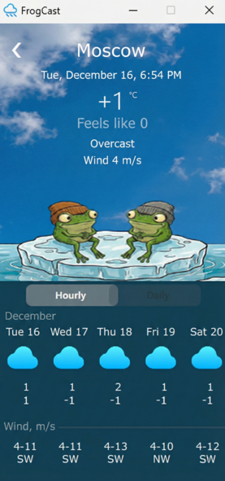

[](README.ru.md)
# FrogCast

A desktop weather application built with **JavaFX** and **OpenWeatherMap API**.

## Screenshots

### City Search


### Detailed Forecast


## Tech Stack

* **Java 17**
* **JavaFX** (FXML for UI)
* **Jackson** (JSON parsing)
* **OpenWeatherMap API**
* **CSS** (UI styling)

## Features

* Search weather by city name.
* Displays current temperature, "feels like" temperature, and wind speed.
* 5-day weather forecast.
* Detailed **3-hour interval** forecast with navigation.
* Robust error handling (404, no internet connection) with a user-friendly UI.

## Configuration

An API key from OpenWeatherMap is required to run this application.

1. Register at [OpenWeatherMap](https://openweathermap.org/).
2. Get a free API Key.
3. Insert your key into `Config.java`:
   ```java
   private static final String API_KEY = "YOUR_API_KEY_HERE";

## How to Run

1. Clone the repository:
   ```bash
   git clone https://github.com/ArtyNikon/WeatherAppFx.git

2. Open the project in IntelliJ IDEA.

3. Run the WeatherApplication.java file.

## Author

Developed by **Artem Nikonorov**
* [My GitHub](https://github.com/ArtyNikon)