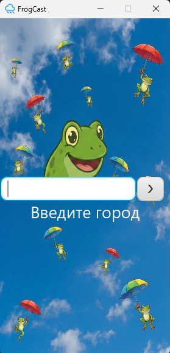
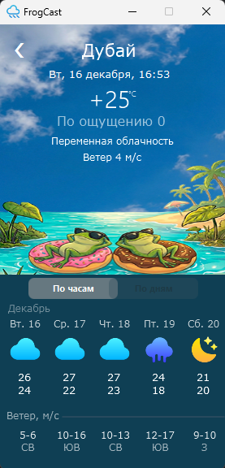

[](README.md)
# FrogCast

Десктопное приложение для просмотра погоды с использованием **JavaFX** и **OpenWeatherMap API**.

## Скриншоты

### Поиск города


### Детальный прогноз


## Технологии

* **Java 17**
* **JavaFX** (FXML для UI)
* **Jackson** (для парсинга JSON)
* **OpenWeatherMap API**
* **CSS** (стилизация интерфейса)

## Функционал

* Поиск погоды по названию города.
* Отображение текущей температуры, ощущаемой температуры, ветра.
* Прогноз на 5 дней.
* Детальный прогноз с **3-часовым интервалом** с навигацией (пролистывание стрелками).
* Обработка ошибок (404, отсутствие интернета) с дружелюбным UI.

## Настройка перед запуском

Для работы приложения необходим API ключ от OpenWeatherMap.

1. Зарегистрируйтесь на [OpenWeatherMap](https://openweathermap.org/).
2. Получите бесплатный API Key.
3. Вставьте ключ в файл `Config.java`:
   ```java
   private static final String API_KEY = "YOUR_API_KEY_HERE";

## Как запустить

1. Клонируйте репозиторий:
   ```bash
   git clone https://github.com/ArtyNikon/WeatherAppFx.git

2. Откройте проект в IntelliJ IDEA.

3. Запустите файл WeatherApplication.java.

## Автор

Разработчик: **Никоноров Артём**
* [Мой GitHub](https://github.com/ArtyNikon)